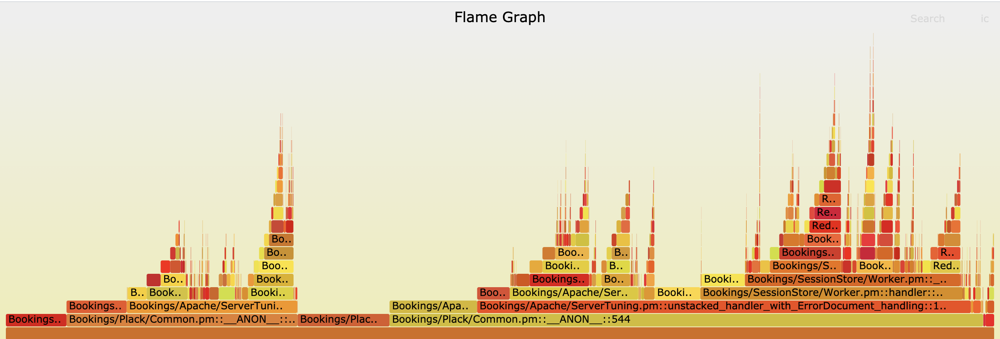

# plperf

A tracing program for uwsgi+perl environment, using ebpf + perldtrace.

Installation:

```
sudo yum install plperf
```

Note: currently only a centos 7 packages is built. A new kernel version is needed (4.19+).

## Usage

### top

Top commands prints out a snapshot of the perl stack frames of traced uwsgi+perl workers.

An example: `sudo plperf -num 3 top`

### flame graph

Flame commands generates a file that can be pased by [flamegraph.pl](https://github.com/brendangregg/FlameGraph/blob/master/flamegraph.pl) to generates a flame graph of the traced workers.

Usage example:

```
sudo timeout 10 plperf -debug -output app.txt -num 1 -ratio 100 flame
wget https://raw.githubusercontent.com/brendangregg/FlameGraph/master/flamegraph.pl
chmod +x flamegraph.pl
./flamegraph.pl app.txt > app.svg
```



## Caveats

* It might trigger a segmentfault on app, probably due to some of the perl xs modules.
* Sometimes the program might be stuck, you would have to manually kill it. Then a manual cleanup is needed: `bash -c 'echo > /sys/kernel/debug/tracing/uprobe_events'`.
* The current flame graph implementation is quite expensive to run on boxes like app where each request is running hundreds of thousands perl subroutines.

## How to compile

Linux source code is needed.

TODO
